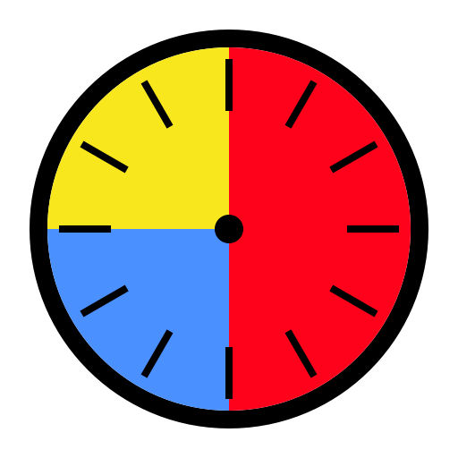
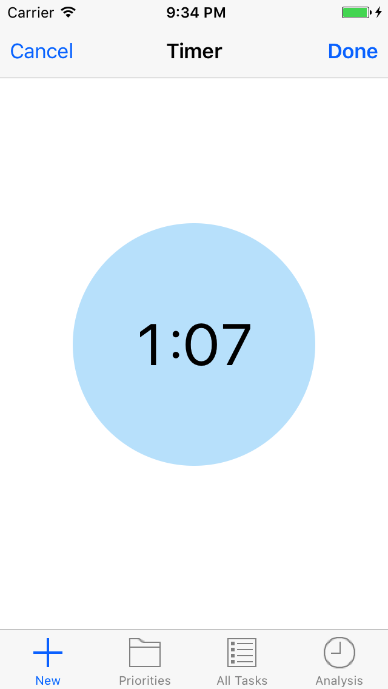
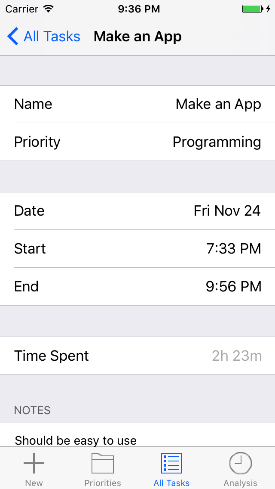
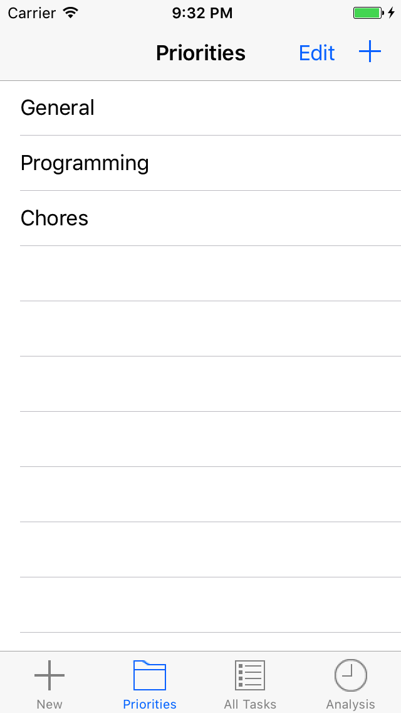
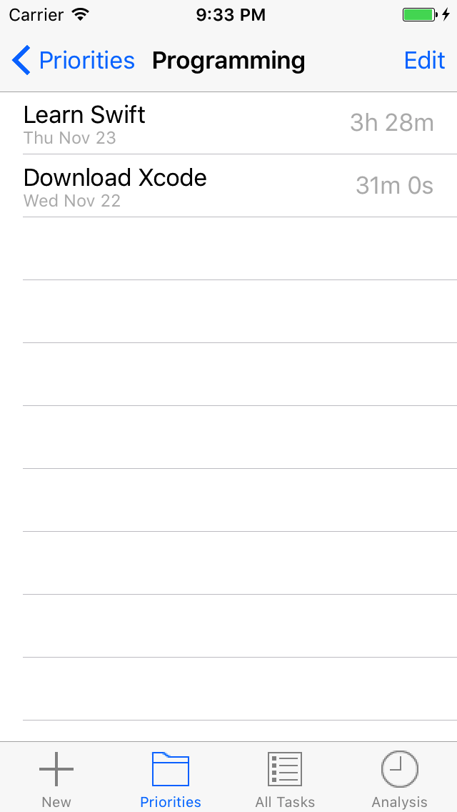
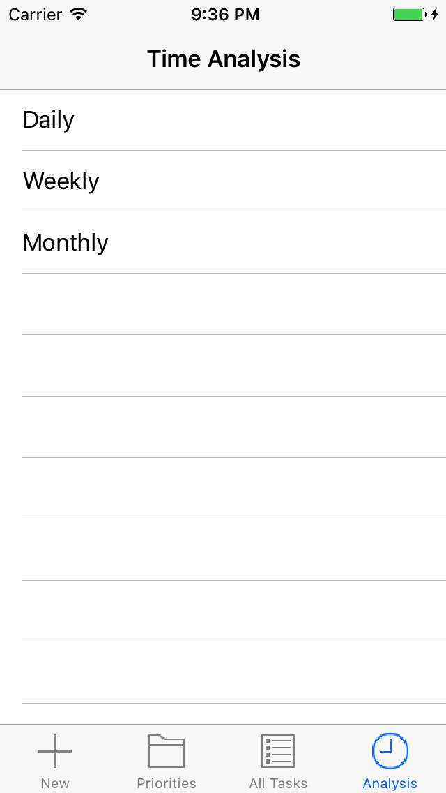
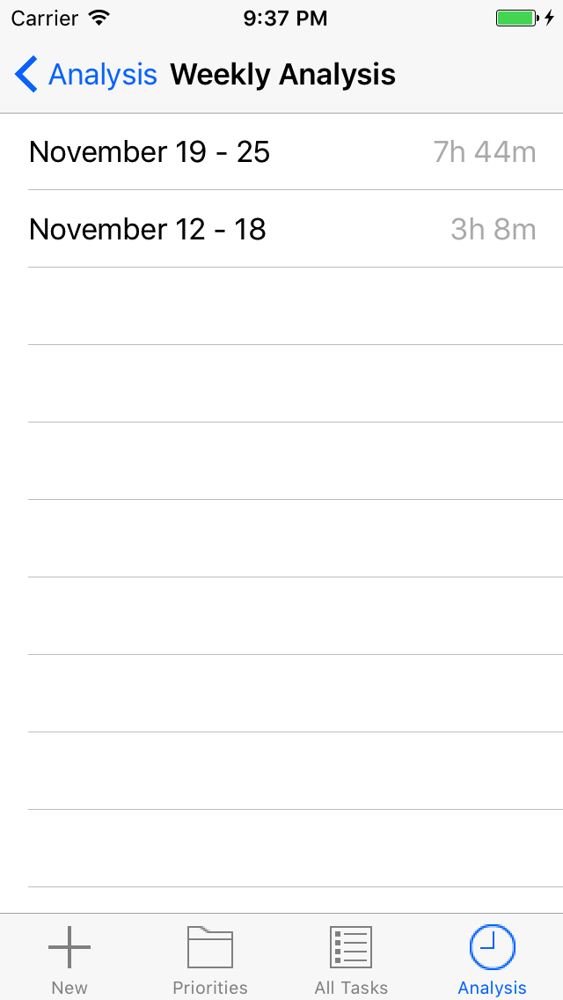
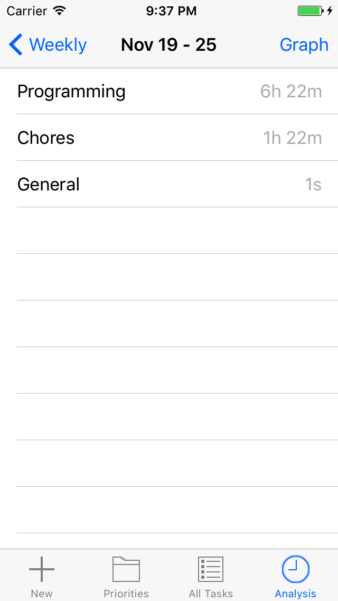
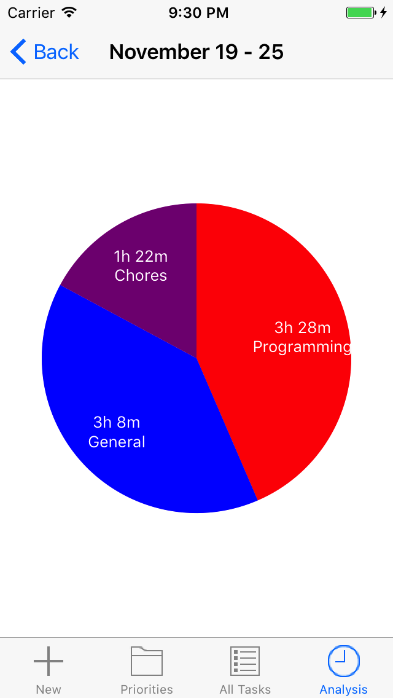

# MyTime - iOS

An iOS application that helps you track and analyze how you are spending your time.

**Understand how you're using your time and reclaim it.**

 
 

 

 
 

 

 
 

 

 
 

 

 
 

## Inspiration

As a student, I can relate to those times when you think you spend a lot of time working, but actually accomplish very little. With MyTime, you can figure out how you are actually spending your time on different priorities and tasks in your life.

## Attributions

Charts library: Daniel Gindi (https://github.com/danielgindi/Charts)

Tab bar icons: IconBeast (http://www.iconbeast.com/free/)

